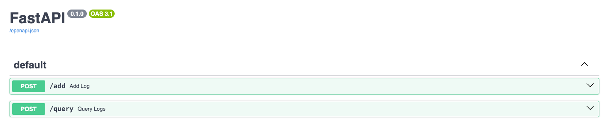
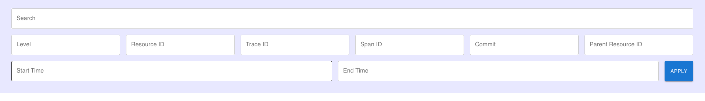

# Log Ingestion and Monitoring

## Specifications

This project demonstrates a log ingestion and searching service. 

Backend: Python FastAPI
<br>
Frontend: React, Typescript
<br>
Database: Postgres

Celery is used for asynchronous log ingestion.

## Docker

Docker needs to be installed. Run this command to get started:
```commandline
docker-compose up --build
```

## How to use

Go to http://localhost:3000/docs to view the backend APIs


Go to http://localhost:8000 to view the frontend searching service


## Improvements

Currently we are using Postgres TSVECTOR with GIN index for full text search. This allows fast searching for whole words, but fails to search for partial words or non-important words like ``a, an, the``. 
We can potentially use ElasticSearch or Solr or similar solutions for effective searching across text and filters.